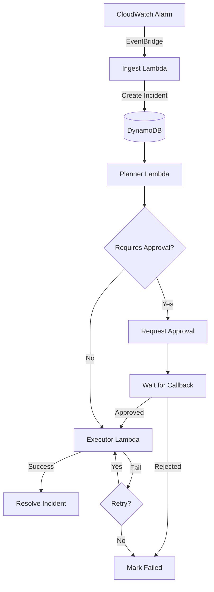

# About Runbook Ranger

**An event-driven AWS SRE bot that converts CloudWatch alarms into safe, policy-driven runbooks and automatically mitigates incidents.**

## Problem Statement
In modern cloud environments, "Mean Time To Recovery" (MTTR) is a critical metric. Manual incident response is slow, error-prone, and leads to engineer burnout. Auto-remediation systems often fail to balance *speed* with *safety*, leading to "automation outages."

## Solution: Runbook Ranger
Runbook Ranger is a safety-first auto-remediation platform built on AWS Serverless. It treats **Runbooks as Code**, enforcing strict safety policies (idempotency, blast radius limits, approvals) before taking any action.

**Key Features:**
- **Event-Driven**: Reacts instantly to CloudWatch Alarms via EventBridge.
- **Safety First**: Built-in idempotency locking, action limits, and human-approval workflows.
- **Runbooks-as-Code**: YAML-defined logic with strongly typed actions.
- **Local Simulation**: Fully functional local CLI (`rr`) for testing runbooks without AWS costs.
- **Observability**: Structured logs and metrics for every decision made.

## Architecture



## Quick Start (Local Demo)

You can run the entire system locally without an AWS account.

1. **Install Dependencies**
   ```bash
   pip install -r requirements.txt
   ```

2. **Simulate an Incident**
   ```bash
   # Simulate a High CPU alarm triggering the scale_asg runbook
   python3 -m cli.rr simulate runbooks/samples/high_cpu_ec2.json
   ```

3. **Interact with the Incident**
   ```bash
   # List active incidents
   python3 -m cli.rr list incidents

   # Approve a pending action (if required)
   python3 -m cli.rr approve <INCIDENT_ID>
   ```

## AWS Deployment

Deployment is managed via AWS CDK.

```bash
cd infra
cdk deploy
```

See `DESIGN.md` for detailed architecture and safety model.

